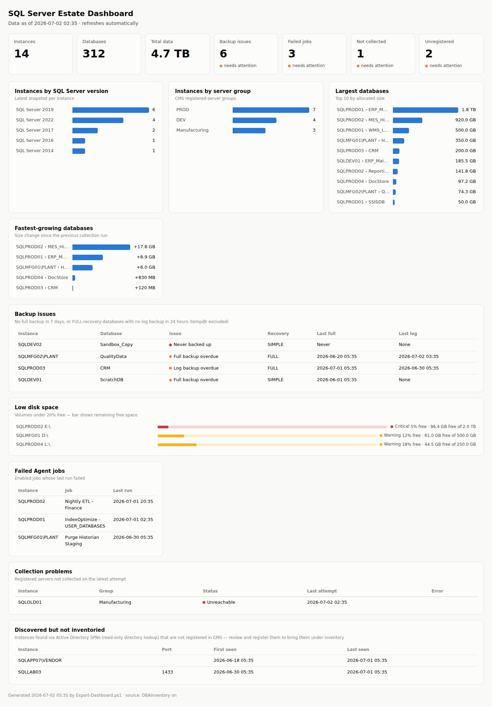

# SQL Server Inventory & Estate Dashboard

A DBA toolset that automatically inventories all SQL Server instances and databases
across the estate, surfaces health insights, and publishes a self-updating HTML
dashboard — without ever scanning the network.

## Overview

The pipeline runs daily as a SQL Agent job on your Central Management Server (CMS):

```
                        ┌─ Step 1: Collect-Inventory.ps1 ──► DBAInventory tables
CMS registered servers ─┤                                        │
Active Directory SPNs ──┼─ Step 2: Discover-Instances.ps1 ──►    │  dbo.vw_* views
                        │                                        ▼
                        └─ Step 3: Export-Dashboard.ps1 ────► index.html
                                                              (file share / IIS)
```

1. **Collect** — [dbatools](https://dbatools.io/) queries every instance registered
   in your CMS server groups and stores instance properties, databases, Agent jobs,
   and disk space in the `DBAInventory` database.
2. **Discover** — a read-only Active Directory query finds `MSSQLSvc` Service
   Principal Names and flags any SQL Server that exists on the domain but *isn't*
   registered in CMS. **This is an LDAP directory lookup, not a network scan** — no
   server is probed, pinged, or port-scanned. A DBA reviews the list and decides
   what to register.
3. **Publish** — a single-file HTML dashboard is regenerated from the data. Drop it
   on a file share or IIS folder; it has no JavaScript or external dependencies,
   auto-reloads every 15 minutes, and supports light and dark mode.



## Files

| File | Description |
|------|-------------|
| `Create-InventoryDB.sql` | Creates (or upgrades in place) the `DBAInventory` database and all tables. Safe to re-run. |
| `Create-InventoryViews.sql` | Creates the insights layer: latest-snapshot views and derived health views (`dbo.vw_*`). Safe to re-run. |
| `Create-AgentJob.sql` | Creates the daily SQL Agent job (6:00 AM) with the three pipeline steps. |
| `Collect-Inventory.ps1` | Collects inventory from CMS-registered servers into `DBAInventory`, then purges history past retention. |
| `Discover-Instances.ps1` | AD SPN discovery; flags instances not registered in CMS. |
| `Export-Dashboard.ps1` | Generates the static HTML dashboard from the views. |
| `Inventory-Reports.sql` | A library of ad-hoc reporting queries built on the same views. |

## What gets collected

- **Instance properties** — SQL version/edition/patch level (with friendly version
  names), CPU count, physical memory, max server memory, MAXDOP, cost threshold,
  collation, clustering/AG enablement, OS version, service account, authentication mode
- **Databases** — size, status, recovery model, compatibility level, last full/diff/log
  backup, owner, read-only flag, create date, collation
- **Agent jobs** — enabled state, category, last run date/outcome, next scheduled run
- **Disk space** — capacity/free per volume (best effort; needs WMI/CIM rights on the host)
- **Discovered instances** — every `MSSQLSvc` SPN in AD, with first/last-seen dates and
  a registered-in-CMS flag

Every run is recorded in `dbo.CollectionLog`, so unreachable or failing servers are
themselves an insight (they appear on the dashboard under *Collection problems*).

## Database schema

All tables live in `DBAInventory.dbo` and are linked by `CollectionID`:

- **CollectionLog** — one row per server per run: Success | Failed | Unreachable
- **InstanceProperties**, **Databases**, **AgentJobs**, **DiskSpace** — per-run detail rows
- **DiscoveredInstances** — one row per instance ever seen in AD (upserted, not per-run)

The `dbo.vw_*` views are the supported query surface:

| View | Answers |
|------|---------|
| `vw_LatestInstances` / `vw_LatestDatabases` / `vw_LatestAgentJobs` / `vw_LatestDisks` | Current estate snapshot (latest successful run per instance) |
| `vw_BackupIssues` | Missing/overdue full backups; FULL-recovery DBs with stale log backups (tempdb excluded) |
| `vw_FailedAgentJobs` | Enabled jobs whose last run failed |
| `vw_DatabaseGrowth` | Size change between the last two runs, per database |
| `vw_LowDiskSpace` | Volumes under 20% free with Warning/Critical severity |
| `vw_LatestAttempt` | Most recent attempt per server, any status (collection health) |
| `vw_UnregisteredInstances` | Instances in AD but not in CMS (seen in the last 30 days) |
| `vw_EstateSummary` | One-row KPI summary — the dashboard tiles |

## Prerequisites

- **PowerShell 5.1** on the CMS server
- **dbatools** module installed for all users:
  ```powershell
  Install-Module dbatools -Scope AllUsers
  ```
- The SQL Agent service account needs:
  - `VIEW SERVER STATE` on all target instances (read-only collection)
  - ordinary domain-user read access to AD (for SPN discovery)
  - WMI/CIM access to target hosts *only* if you want disk-space data
    (set `$CollectDiskSpace = $false` in `Collect-Inventory.ps1` to skip)

## Setup

1. **Create the database** — run `Create-InventoryDB.sql` on your CMS instance.
2. **Create the views** — run `Create-InventoryViews.sql` on the same instance.
3. **Deploy the scripts** — copy the three `.ps1` files to `C:\DBA\Inventory\` on the CMS server.
4. **Configure server groups** — edit `$ServerGroups` in `Collect-Inventory.ps1` to
   match your CMS registered server group names exactly (nested groups use backslash
   paths, e.g. `"ParentGroup\ChildGroup"`).
5. **Choose a dashboard location** — set `$OutputPath` in `Export-Dashboard.ps1`
   (a UNC share like `\\fileserver\dba$\dashboard\index.html`, or an IIS folder
   like `C:\inetpub\wwwroot\sqlestate\index.html`).
6. **Create the Agent job** — run `Create-AgentJob.sql` to schedule the daily pipeline.

## Configuration

At the top of each PowerShell script:

```powershell
$CMSInstance   = $env:COMPUTERNAME       # CMS server (or "SERVER\INSTANCE")
$InventoryDB   = 'DBAInventory'          # Target database name
$LogDirectory  = 'C:\DBA\Inventory\Logs' # Log file output path

# Collect-Inventory.ps1 only:
$RetentionDays    = 400                  # purge collection history older than this
$CollectDiskSpace = $true                # requires WMI/CIM rights on hosts
$ServerGroups     = @('PROD', 'DEV', 'Manufacturing')

# Export-Dashboard.ps1 only:
$OutputPath = 'C:\DBA\Inventory\Dashboard\index.html'
```

## Running manually

The Agent job runs the full pipeline daily at 6:00 AM. To run any stage by hand:

```powershell
powershell.exe -NonInteractive -NoProfile -ExecutionPolicy Bypass -File "C:\DBA\Inventory\Collect-Inventory.ps1"
powershell.exe -NonInteractive -NoProfile -ExecutionPolicy Bypass -File "C:\DBA\Inventory\Discover-Instances.ps1"
powershell.exe -NonInteractive -NoProfile -ExecutionPolicy Bypass -File "C:\DBA\Inventory\Export-Dashboard.ps1"
```

Logs are written to `C:\DBA\Inventory\Logs\` with timestamped filenames.

## The dashboard

`Export-Dashboard.ps1` produces one self-contained HTML file:

- **KPI tiles** — instances, databases, total data size, and open issue counts
  (backup issues, failed jobs, uncollected servers, unregistered instances)
- **Charts** — instances by SQL version, instances by server group, largest
  databases, fastest-growing databases since the previous run
- **Issue tables** — backup issues, low disk space (with severity meters), failed
  Agent jobs, collection problems, and discovered-but-not-inventoried instances
- Auto-reloads every 15 minutes (good for a wall monitor), light/dark mode follows
  the OS, and the file is swapped in atomically so viewers never see a half-written page

Because the dashboard is regenerated as the last step of the daily job, it always
reflects the latest collection with zero extra infrastructure. If you later want
richer slicing, the `dbo.vw_*` views are also a ready-made source for Power BI or
Grafana — point them at the same views the HTML dashboard uses.

## Discovery without scanning

Randomly sweeping a corporate network for port 1433 is (rightly) not an option in
most shops. Instead, `Discover-Instances.ps1` reads the `MSSQLSvc/*` Service
Principal Names that domain-joined SQL Servers register in Active Directory as part
of Kerberos setup. That is:

- **read-only** — a standard LDAP query any domain user can run
- **passive** — no packet is ever sent to the discovered servers
- **actionable** — anything not in CMS shows up in `dbo.vw_UnregisteredInstances`
  and on the dashboard for a DBA to review, register, or annotate:

```sql
UPDATE dbo.DiscoveredInstances
SET Notes = 'Vendor-managed appliance — no access'
WHERE SqlInstance = 'SOMEHOST\SOMEINSTANCE';
```

Known gaps: instances running under local accounts without SPNs, or in untrusted
domains, won't appear. Discovery finds the common case; CMS registration remains
the source of truth for what gets collected.

## Reports

`Inventory-Reports.sql` contains ad-hoc queries organized in eight sections, all
built on the same views as the dashboard:

| Section | Queries |
|---------|---------|
| 0. Estate at a glance | One-row KPI summary |
| 1. Inventory & estate overview | Counts by group/version; full instance inventory; size by instance |
| 2. Version & patch compliance | Servers off target CU; low compat levels; out-of-support versions |
| 3. Backup health | All current backup issues with age |
| 4. Capacity & growth | Largest databases; growth between runs; low disk space |
| 5. Agent job health | Failed jobs; enabled-but-unscheduled; never-run jobs |
| 6. Collection health | Unreachable/failed servers; run history; never-collected servers |
| 7. Discovery | Unregistered instances; full discovery history; annotation template |

## Retention

`Collect-Inventory.ps1` keeps `$RetentionDays` (default 400) of history — enough
for year-over-year growth comparisons — and purges older rows at the end of each
run so the inventory database doesn't grow unbounded.
